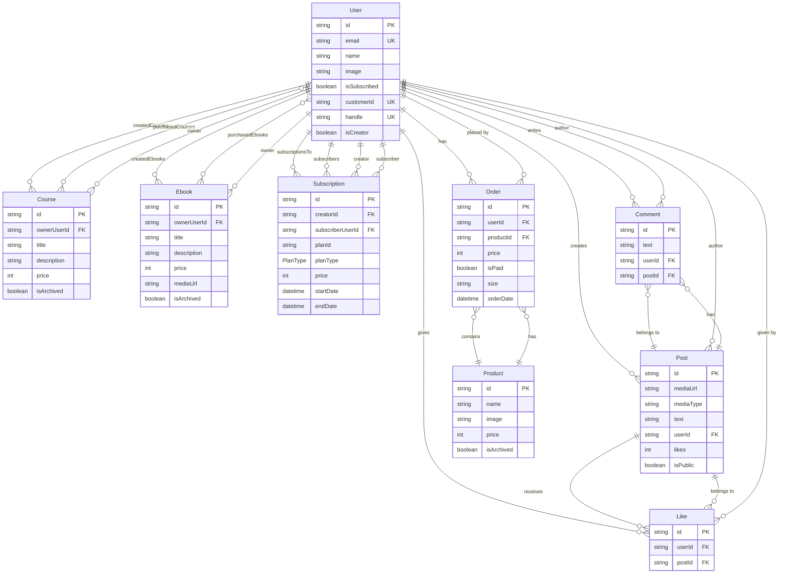

# Schema Relationships

```mermaid
erDiagram
User ||--o{ Course : "createdCourses"
User }o--o{ Course : "purchasedCourses"
User ||--o{ Ebook : "createdEbooks"
User }o--o{ Ebook : "purchasedEbooks"
User ||--o{ Subscription : "subscriptionsTo"
User ||--o{ Subscription : "subscribers"
User ||--o{ Order : "has"
User ||--o{ Comment : "writes"
User ||--o{ Like : "gives"
User ||--o{ Post : "creates"
Course }o--|| User : "owner"
Ebook }o--|| User : "owner"
Subscription }o--|| User : "creator"
Subscription }o--|| User : "subscriber"
Post }o--|| User : "author"
Post ||--o{ Comment : "has"
Post ||--o{ Like : "receives"
Comment }o--|| Post : "belongs to"
Comment }o--|| User : "author"
Like }o--|| Post : "belongs to"
Like }o--|| User : "given by"
Product ||--o{ Order : "has"
Order }o--|| User : "placed by"
Order }o--|| Product : "contains"
User {
string id PK
string email UK
string name
string image
boolean isSubscribed
string customerId UK
string handle UK
boolean isCreator
}
Course {
string id PK
string ownerUserId FK
string title
string description
int price
boolean isArchived
}
Ebook {
string id PK
string ownerUserId FK
string title
string description
int price
string mediaUrl
boolean isArchived
}
Subscription {
string id PK
string creatorId FK
string subscriberUserId FK
string planId
PlanType planType
int price
datetime startDate
datetime endDate
}
Post {
string id PK
string mediaUrl
string mediaType
string text
string userId FK
int likes
boolean isPublic
}
Comment {
string id PK
string text
string userId FK
string postId FK
}
Like {
string id PK
string userId FK
string postId FK
}
Product {
string id PK
string name
string image
int price
boolean isArchived
}
Order {
string id PK
string userId FK
string productId FK
int price
boolean isPaid
string size
datetime orderDate
}
```
